<div align="center">



<br/><br/>

[](https://pardheev.dev)
[](https://linkedin.com/in/pardheev-vatturu)
[](mailto:pardheev.vatturu1234@gmail.com)
[](https://discord.gg/pardheev_draws)
[](https://pardheev.dev/resume/resume.pdf)

</div>

<br/>

## &nbsp; About

```ts
const pardheev: Developer = {
  role:      "Full-Stack Developer",
  studying:  "B.Tech AI Engineering @ Amrita Vishwa Vidyapeetham (2023-2027)",
  location:  "Coimbatore, India",
  focus:     ["Full-Stack Web", "AI / ML", "NLP", "Time-Series Forecasting"],
  offScreen: ["Realism & digital art", "Philosophy, psychology & productivity books"],
  learnsBy:  "building things",
};
```

<br/>

## &nbsp; Stack

<sub><code>// languages</code></sub><br/>


<sub><code>// frontend</code></sub><br/>


<sub><code>// backend</code></sub><br/>


<sub><code>// databases</code></sub><br/>


<sub><code>// ai / ml</code></sub><br/>


<sub><code>// tools &amp; deploy</code></sub><br/>


<br/>

## &nbsp; Projects

### Codexa
Web-based coding assessment platform for programming tests.<br/>


[](https://codexa.pardheev.dev)
[](https://github.com/p-art-dheev/Codexa)

### Nutrix
Recommends meals based on calorie and nutritional needs, optimised with linear programming.<br/>
 

[](https://nutrix.pardheev.dev)
[](https://github.com/p-art-dheev/nutrix)

### Aspect Based Sentiment Analysis
BERT-based NLP model that classifies sentiment from context-rich text.<br/>
  

[](https://github.com/p-art-dheev/absa)

### Electricity Load Forecasting
Forecasts electricity demand from 16 years of PJM hourly data, comparing SARIMA / SETAR with LSTM.<br/>
  

[](https://github.com/p-art-dheev/PJME-Weekly-Forecast)

<br/>

## &nbsp; Activity

<div align="center">


</div>

<br/>

<div align="center">


<br/><br/>


</div>
