<picture>
  <source media="(prefers-color-scheme: dark)" srcset="assets/hero.svg">
  <source media="(prefers-color-scheme: light)" srcset="assets/hero-light.svg">
  
</picture>

  

## &nbsp; /dev

I build across the full stack and care about the ML side of it too: web apps, NLP models and time-series forecasting. I learn by shipping things, and most of what I know came from a project that needed it.

<code>// languages</code> 

<code>// frontend</code> 

<code>// backend</code> 

<code>// databases</code> 

<code>// ai / ml</code> 

<code>// tools &amp; deploy</code> 

## &nbsp; /draw

When I'm not at the keyboard I'm drawing: **realism** with graphite and **digital art**. I also read a lot of philosophy, psychology and productivity books. Code and art feel like the same habit to me: stare at a blank canvas, break it into small steps, iterate until it looks right.

## &nbsp; /activity

<picture>
  <source media="(prefers-color-scheme: dark)" srcset="https://github-readme-stats.vercel.app/api?username=p-art-dheev&show_icons=true&theme=tokyonight&hide_border=true&include_all_commits=true&count_private=true">
  <source media="(prefers-color-scheme: light)" srcset="https://github-readme-stats.vercel.app/api?username=p-art-dheev&show_icons=true&hide_border=true&include_all_commits=true&count_private=true&bg_color=ffffff&title_color=6366f1&icon_color=0ea5e9&text_color=1f2328">
  
</picture>
<picture>
  <source media="(prefers-color-scheme: dark)" srcset="https://github-readme-stats.vercel.app/api/top-langs/?username=p-art-dheev&theme=tokyonight&hide_border=true&layout=compact">
  <source media="(prefers-color-scheme: light)" srcset="https://github-readme-stats.vercel.app/api/top-langs/?username=p-art-dheev&hide_border=true&layout=compact&bg_color=ffffff&title_color=6366f1&text_color=1f2328">
  
</picture>

<picture>
  <source media="(prefers-color-scheme: dark)" srcset="https://streak-stats.demolab.com?user=p-art-dheev&theme=tokyonight&hide_border=true">
  <source media="(prefers-color-scheme: light)" srcset="https://streak-stats.demolab.com?user=p-art-dheev&hide_border=true&background=FFFFFF&ring=6366f1&fire=ec4899&currStreakNum=1f2328&sideNums=1f2328&currStreakLabel=6366f1&sideLabels=57606a&dates=57606a">
  
</picture>

<picture>
  <source media="(prefers-color-scheme: dark)" srcset="https://github-readme-activity-graph.vercel.app/graph?username=p-art-dheev&theme=tokyo-night&hide_border=true&area=true">
  <source media="(prefers-color-scheme: light)" srcset="https://github-readme-activity-graph.vercel.app/graph?username=p-art-dheev&bg_color=ffffff&color=6366f1&line=0ea5e9&point=ec4899&area_color=6366f1&title_color=1f2328&hide_border=true&area=true">
  
</picture>

<picture>
  <source media="(prefers-color-scheme: dark)" srcset="https://raw.githubusercontent.com/p-art-dheev/p-art-dheev/output/snake-dark.svg">
  <source media="(prefers-color-scheme: light)" srcset="https://raw.githubusercontent.com/p-art-dheev/p-art-dheev/output/snake.svg">
  
</picture>

 

  

